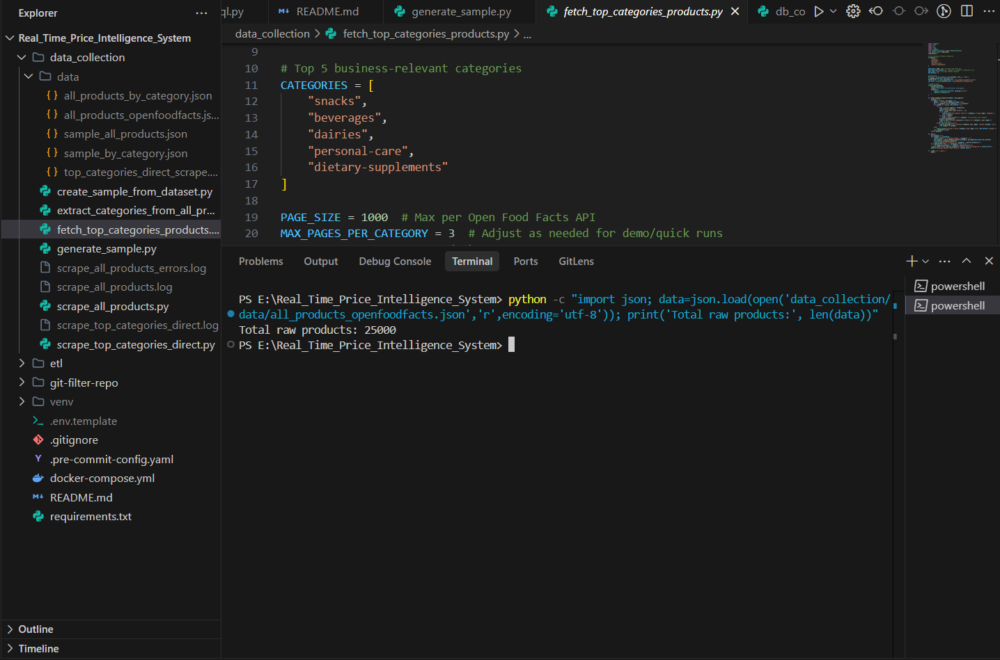

# 🛒 Real-Time Price Intelligence System

A scalable, end-to-end simulation of a real-world **Price Intelligence System** for e-commerce, powered by clean pipelines, structured data, and business-aligned insights.

---

## 🚧 Project Status: Phase 1 Complete

**✔ 20,000+ products scraped**  
**✔ Robust data pipeline built**  
**✔ Business-driven categorization logic applied**  
➡️ *Next: EDA, ML modeling, real-time dashboard, deployment*

---

## 📦 Project Summary

In e-commerce, pricing strategy is critical — it directly affects revenue, profit margins, and market competitiveness. This project builds the foundation of a system that helps businesses:

- Continuously **track competitor pricing**
- **Analyze price trends**
- Optimize pricing using **ML-based recommendations**

---

## 🔁 Phase 1: Scalable Data Collection Pipeline

To simulate real-world scale:

- ✅ Scraped **20,000+ products** using the [Open Food Facts API](https://world.openfoodfacts.org/data)
- ✅ Covered **15 major categories × 120+ pages**
- ✅ Generated structured data in **JSON + CSV** formats

## 📂 Sample Dataset (read‑only)
A 100‑row extract of **all products**:  
[🔗 Sample Dataset (Google Drive)](https://drive.google.com/file/d/1lv10h0q_ELuV4nGhWJuKLVCrBOMiMXNY/view?usp=sharing)
+

### ⚙️ Pipeline Features:

- Retry logic with **exponential backoff**
- Rate-limiting to avoid IP bans
- Logging + fault tolerance
- **Post-scraping categorization** using business keywords:
  - Snacks
  - Beverages
  - Dairy
  - Personal Care
  - Health Supplements

### 🧠 Why Open Food Facts?

Attempted Flipkart scraping but faced heavy anti-bot protection. Pivoted to Open Food Facts — an open-source, ethical, large-scale API ideal for simulation.

---

## 📁 Project Structure

## Project Phases & Roadmap

### Phase 1: Data Collection
Folder: `data_collection/`
- Scripts to scrape OpenFoodFacts and Flipkart
- Implement proxy rotation, rate limiting, retries
- Save raw JSON outputs in `data_collection/data/`

### Phase 2: Data Storage & ETL
Folder: `etl/`
- `load_to_mysql.py`: Bulk load full JSON from `data_collection/data/` into MySQL
- `transform.py`: Clean, normalize, enrich data (pandas or SQL)
- `sql/`: DDL for tables, views, stored procedures
- `config/`: Connection templates, env parsing

### Phase 3: API & Backend Services
Folder: `api/`
- FastAPI endpoints for querying products, categories
- Swagger/OpenAPI docs
- Dockerfile for API service

### Phase 4: Dashboard & Visualization
Folder: `dashboard/`
- Streamlit or React dashboard for trends and comparisons
- Charts: price over time, category comparisons
- Dockerfile for dashboard service

### Phase 5: Advanced Analytics & ML
Folder: `ml/`
- Price forecasting models (time series)
- Anomaly detection on price changes
- Market basket analysis
- Automated insights via scheduled jobs

### Phase 6: Integration & Deployment
- Container orchestration (Docker Compose / Kubernetes)
- CI/CD pipelines (GitHub Actions)
- Monitoring & alerts

## Project Structure
```plaintext
Real_Time_Price_Intelligence_System/
├── data_collection/               # Scraping scripts and utilities
│   ├── data/                      # Raw JSON outputs
│   │   ├── sample_all_products.json
│   │   └── sample_by_category.json  # Generated sample
│   ├── extract_categories_from_all_products.py
│   ├── generate_sample.py         # Builds categorized sample JSON
│   ├── fetch_top_categories_products.py
│   ├── scrape_all_products.py
│   ├── scrape_top_categories_direct.py
│   └── [*.log]                    # Log files
├── docker-compose.yml             # Services definitions
├── .env.template                  # Environment variables template
├── requirements.txt               # Python dependencies
├── .pre-commit-config.yaml        # Security hooks config
├── .gitignore                     # Ignored files
├── README.md                      # Project documentation
├── git-filter-repo/               # Git filter repository data
└── venv/                          # Virtual environment (ignored)
```


---

## 🛠️ Tech Stack

- **Python** (Requests, Pandas, NumPy, JSON, Regex)
- **API Handling** (Open Food Facts)
- **Data Processing** (Pandas)
- **Visualization** (Matplotlib, Seaborn – upcoming)
- **ML Modeling** (scikit-learn – upcoming)
- **Dashboards** (Streamlit – upcoming)

---

## Next Steps
- Scaffold `etl/` directory and add loader script
- Define table schemas and transformation logic
- Schedule ETL jobs (e.g., Airflow)
- Exploratory Data Analysis (EDA) on pricing patterns
- Real-time interactive dashboard with filters
- ML model to detect price anomalies + suggest optimal pricing
- Full **ETL → ML → Deployment** pipeline

---

## 💡 Key Learnings

- Reliable scraping pipelines must be **fault-tolerant, ethical, and scalable**
- **Business-aligned categorization** beats raw category tags
- Clean, structured data unlocks downstream insights and automation

---

## 🤝 Connect & Discuss

Curious what pricing signals **you** think are most critical for modern e-commerce?  
Drop a suggestion or open an issue!

📬 [LinkedIn](https://www.linkedin.com/in/shanusaraswat) | [Project Post](#) *(add your live post URL)*

---

## 📄 License

MIT License — feel free to fork, build on, or improve.

---

## 🙌 Contributions

Got an idea or improvement? PRs and suggestions are welcome.
